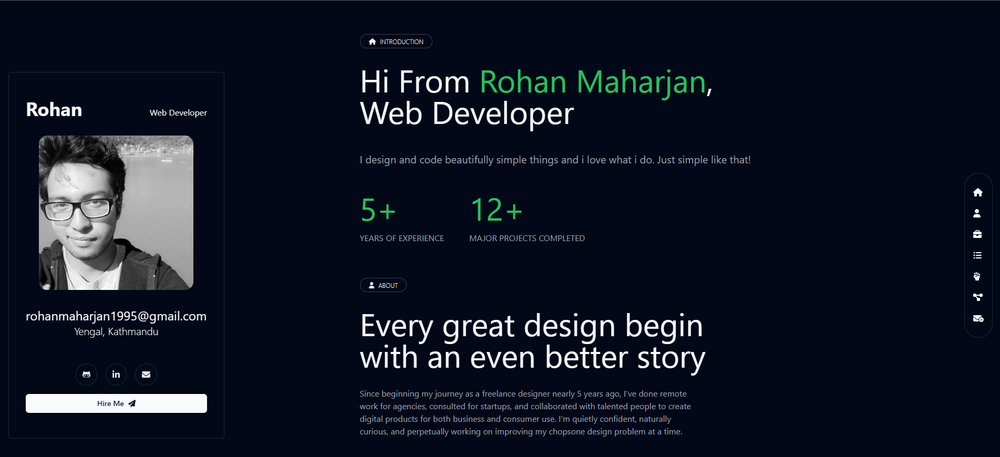

# Personal Portfolio

Welcome to my personal portfolio repository! This project showcases my skills, projects, and achievements as a developer. Feel free to explore and learn more about me and my work.

## Table of Contents

- [About Me](#about-me)
- [Projects](#projects)
- [Skills](#skills)
- [Contact](#contact)
- [License](#license)

## About Me

Hello! I'm Rohan maharjan, a passionate and creative wev developer with a love for technology. This section provides a brief overview of who I am, my background, and my interests.

### Portfolio URL

You can view my live portfolio at [https://your-portfolio-url.com](https://your-portfolio-url.com).

## Projects

Here are some of the key projects I've worked on. Each project comes with a description, technologies used, and links to the live project or its GitHub repository.

### Project 1: [Project Name 1](https://github.com/your-username/project-1)

- Description: A brief description of the project.
- Technologies Used: List the technologies and frameworks used.
- [Live Demo](https://your-project-url.com)
- [GitHub Repository](https://github.com/your-username/project-1)

### Project 2: [Project Name 2](https://github.com/your-username/project-2)

- Description: A brief description of the project.
- Technologies Used: List the technologies and frameworks used.
- [Live Demo](https://your-project-url.com)
- [GitHub Repository](https://github.com/your-username/project-2)

<!-- Add more projects as needed -->

## Skills

I have experience in a wide range of technologies and skills. Here are some of the key skills that I bring to the table:

- Front-End Development
- Back-End Development
- JavaScript
- HTML/CSS
- React
- Angular
- Node.js
- SQL/NoSQL Databases
- Version Control (Git/GitHub)
- Problem Solving

## Contact

I'm always open to new opportunities and collaborations. Feel free to reach out to me through one of the following channels:

- Email: [rohanmaharjan1995@gmail.com](mailto:rohanmaharjan1995@gmail.com)
- LinkedIn: [Rohan Maharjan](https://www.linkedin.com/in/rohan-maharjan-414426200)
- Portfolio: [https://your-portfolio-url.com](https://your-portfolio-url.com)

## License

This project is licensed under the [MIT License](LICENSE.md). Feel free to fork, modify, and use it for your own portfolio.
